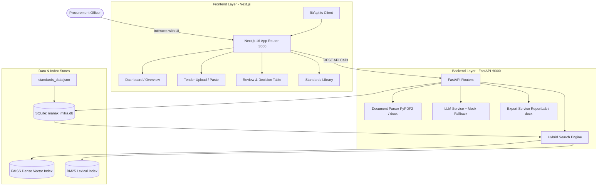

# 🇮🇳 Manak Mitra — AI-Powered Indian Standards Recommender for Procurement Tenders

[](https://fastapi.tiangolo.com)
[](https://nextjs.org)
[](https://tailwindcss.com)
[](https://github.com/facebookresearch/faiss)
[](https://python.org)
[](https://www.typescriptlang.org)
[](LICENSE)

> **Smart India Hackathon (SIH 2026) Prototype**  
> An intelligent decision-support system that automatically maps procurement tender requirements to relevant Bureau of Indian Standards (BIS / IS), explains why each standard applies, provides an Officer Review workflow, and exports official compliance reports.

📖 **Looking for a deep-dive explanation?** Read the complete documentation in [WEBSITE_AND_WORKING_EXPLAINER.md](file:///d:/SIH%202026/WEBSITE_AND_WORKING_EXPLAINER.md).

---

## 🌟 Key Features

1. **Multi-Format Document Parsing**: Upload tender documents in **PDF**, **DOCX**, or **TXT** format, or directly paste tender text with 1-click sample document loaders.
2. **AI Requirement Extraction**: Analyzes raw tender specifications to extract structured requirements (Technical, Safety, Performance, Material, Quality) with domain keywords.
3. **Dual Hybrid Search Engine**: Combines **Dense Vector Semantic Embeddings** (`sentence-transformers/all-MiniLM-L6-v2` + FAISS) with **Sparse Lexical Keyword Matching** (BM25Okapi) for balanced precision and recall.
4. **Automated AI Justifications**: Synthesizes human-readable justifications explaining *why* a candidate standard is applicable to the given requirement.
5. **Officer Review Workflow**: Procurement officers can inspect, verify, and mark candidates as **Accept (✓)**, **Reject (✗)**, or **Flag for Review (🚩)**.
6. **Multi-Format Export Engine**: Generates publication-ready **PDF compliance reports** (via ReportLab) and editable **DOCX reports** (via python-docx).
7. **Searchable Standards Library**: Browse 41+ Indian Standards across 8 key sectors (Civil, Electrical, IT, Fire Safety, Food, Textiles, Mechanical, Chemicals) with interactive scope & keyword viewers.
8. **100% Offline / Demo Capable**: Operates with OpenAI-compatible APIs or in a high-accuracy **mock fallback mode** requiring no external API keys.

---

## 🏗️ System Architecture



---

## 🚀 Getting Started

### Prerequisites
- **Python 3.10+**
- **Node.js 18+** & `npm`
- *(Optional)* An OpenAI-compatible API key (Groq, Together AI, OpenAI, Ollama, etc.)

---

### Step 1: Start the Backend (FastAPI)

```powershell
cd "d:\SIH 2026\backend"

# Install Python dependencies
pip install -r requirements.txt

# Start FastAPI server on port 8000
python main.py
```

- Backend server starts at: **http://localhost:8000**
- Interactive Swagger API documentation: **http://localhost:8000/docs**
- Automatic startup will:
  1. Initialize SQLite database (`manak_mitra.db`).
  2. Seed 41 comprehensive Indian Standards.
  3. Precompute vector embeddings and build FAISS + BM25 indexes.

---

### Step 2: Start the Frontend (Next.js)

```powershell
cd "d:\SIH 2026\frontend"

# Install Node dependencies (if not already installed)
npm install

# Launch Next.js dev server on port 3000
npm run dev
```

- Open your browser at: **http://localhost:3000**

---

### Step 3: (Optional) Set an LLM API Key

Copy `.env.example` to `.env` in the root or `backend/` directory:

```env
OPENAI_API_KEY=sk-your-api-key
OPENAI_BASE_URL=https://api.openai.com/v1
OPENAI_MODEL=gpt-4o-mini
```

> **Note**: If `OPENAI_API_KEY` is left blank, the app **automatically operates in Demo Mode** with rule-based regex extraction and template justifications, ensuring 100% functionality without external network dependencies.

---

## 🧪 Testing & Verification

### Run Pytest Suite
```powershell
cd "d:\SIH 2026"
python -m pytest backend/tests/ -v
```
*Expected: 6 passed tests (Health check, standards search, sector filters, sample tenders, full pipeline, stubs).*

### Run Live End-to-End Verification
With the backend running on `:8000`:
```powershell
cd "d:\SIH 2026"
python backend/tests/verify_live.py
```
*Expected: 6/6 pipeline steps succeed (Extract → Recommend → Review Decision → PDF Export → DOCX Export).*

---

## 📁 Repository Directory Structure

```
SIH 2026/
├── README.md                                # Project overview & quickstart
├── WEBSITE_AND_WORKING_EXPLAINER.md         # Comprehensive system & working guide
├── .gitignore                               # Git ignore configuration
├── .env.example                             # Environment variable template
│
├── backend/                                 # FastAPI Backend Service
│   ├── main.py                              # Application entrypoint & lifespan
│   ├── config.py                            # Settings & environment parser
│   ├── database.py                          # SQLAlchemy engine & session factory
│   ├── models.py                            # Database ORM models (5 entities)
│   ├── schemas.py                           # Pydantic v2 validation models
│   ├── seed_db.py                           # Database seeder script
│   │
│   ├── routers/                             # REST API Endpoints
│   │   ├── extract.py                       # POST /api/extract (document upload/text)
│   │   ├── recommend.py                     # POST /api/recommend (hybrid matching)
│   │   ├── review.py                        # PUT /api/review/{id} (officer review)
│   │   ├── standards.py                     # GET /api/standards (search & filter)
│   │   └── export.py                        # POST /api/export (PDF / DOCX download)
│   │
│   ├── services/                            # Core Logic & Algorithms
│   │   ├── search_service.py                # FAISS + BM25 hybrid search implementation
│   │   ├── llm_service.py                   # LLM client + offline mock engine
│   │   ├── document_parser.py               # PyPDF2 & python-docx extractors
│   │   ├── export_service.py                # ReportLab PDF & DOCX generator
│   │   └── stubs.py                         # Neo4j, Sarvam AI, BIS API, GeM stubs
│   │
│   ├── seed/                                # Seed Data Assets
│   │   ├── standards_data.json              # 41 realistic Indian Standards
│   │   └── sample_tenders/                  # Construction, IT, Food Supply tenders
│   │
│   └── tests/                               # Automated Test Suite
│       ├── test_api.py                      # Pytest unit & endpoint integration tests
│       └── verify_live.py                   # Live end-to-end HTTP pipeline verifier
│
└── frontend/                                # Next.js 16 Frontend
    ├── package.json                         # Node dependencies & scripts
    ├── next.config.ts                       # Next.js configuration
    └── src/
        ├── app/                             # App Router Pages
        │   ├── page.tsx                     # Landing Dashboard with recent tenders
        │   ├── layout.tsx                   # Main layout with Navbar
        │   ├── globals.css                  # Modern Tailwind CSS styles & tokens
        │   ├── analysis/new/page.tsx        # Upload / text input page
        │   ├── analysis/[id]/page.tsx       # Results review & export interface
        │   └── standards/page.tsx           # Searchable Indian Standards Library
        ├── components/                      # Reusable UI Components
        │   ├── FileUpload.tsx               # Drag-and-drop file upload zone
        │   ├── RequirementCard.tsx          # Extracted requirement display card
        │   ├── RecommendationTable.tsx      # Ranked standards table with actions
        │   ├── StandardCard.tsx             # Expandable standard item
        │   ├── Navbar.tsx                   # Top navigation bar
        │   └── LoadingSpinner.tsx           # Visual loading indicator
        └── lib/
            └── api.ts                       # Typed API client wrapper
```

---

## 🔮 Future Enhancements (Stubs Included)

The codebase includes architectural stub endpoints in `backend/services/stubs.py` for future production phases:
1. **Neo4j Knowledge Graph**: Standard lineage, amendments, and cross-standard reference graphs.
2. **Sarvam AI Translation**: Multilingual vernacular support for tenders in regional Indian languages.
3. **Live BIS Online API**: Dynamic synchronization with official real-time BIS portals.
4. **GeM / CPPP Integration**: Direct ingestion from Government e-Marketplace and Central Public Procurement Portal.

---

## 👥 Authors & Acknowledgments

- Developed for **Smart India Hackathon 2026 (SIH 2026)**
- Built with Google Antigravity IDE
- Dedicated to modernizing and accelerating Indian public procurement compliance.
