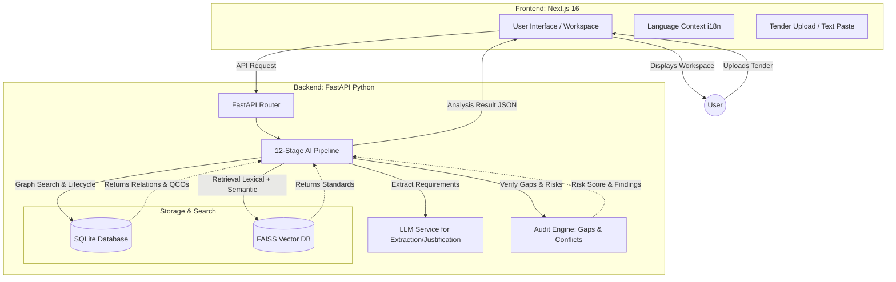

# 🇮🇳 Manak Mitra — AI Recommendations for Indian Standards

[](https://fastapi.tiangolo.com)
[](https://nextjs.org)
[](https://tailwindcss.com)
[](https://docker.com)

> **Smart India Hackathon (SIH 2026) Prototype**  
> Problem Statement: SIH26108 - AI Powered Recommendation Engine for Identifying Applicable Indian Standards for Procurement Specifications
> Tagline: "Standards for Smarter Procurement"

## 🌟 Key Features
- **12-Stage AI Analysis Pipeline**: Extracts requirements, maps them to the BIS graph, validates QCOs, checks lifecycles, and flags gaps/conflicts.
- **Two-Pane Workspace**: Review requirements and recommendations side-by-side with the original tender document.
- **Compliance Audit Trail**: Every AI action and human approval/rejection is permanently logged.
- **Multilingual UI**: Gov-Tech design system available in 6 Indian languages.
- **Docker Ready**: Run the entire stack locally with a single command.

## 🚀 Getting Started

### Method 1: Docker (Recommended)
You can start the entire application using Docker Compose:
```bash
docker compose up --build -d
```
The website will be available at **http://localhost:3000** and the backend at **http://localhost:8000**.

### Method 2: Manual Start

**1. Start Backend (Terminal 1)**
```powershell
cd backend
pip install -r requirements.txt
python -m uvicorn main:app --reload --port 8000
```
*Note: On the very first run, it will automatically build the FAISS index and seed the SQLite database (`manak_mitra.db`).*

**2. Start Frontend (Terminal 2)**
```powershell
cd frontend
npm install
npm run dev
```
Open **http://localhost:3000** in your browser.

## 📖 How to Operate (Workflow)
1. **Dashboard**: View your past analyses. Click "+ New Analysis".
2. **New Analysis**: Paste your tender text or upload a document. Select a Domain Hint, toggle the Cross-Encoder for higher accuracy, and click Start.
3. **Loading Status**: Watch the 12-stage pipeline execute in real-time.
4. **Results Workspace**: 
   - **Requirements Tab**: Review each extracted requirement. Approve or Reject the recommended standards. Pay attention to red **QCO** chips (mandatory standards).
   - **Coverage Tab**: Review the Gap Analysis to see what standard categories you missed in your tender.
   - **Conflicts Tab**: See if you referenced outdated standards.
   - **Audit Tab**: Review the system's decisions.
5. **Finalize**: Generate the procurement compliance report.

## 🏗️ The Core Architecture

Manak Mitra is a **Compliance and Audit Engine**, not just a search box. It enforces a strict "AI proposes, Human disposes" workflow.


```mermaid
graph TD
    subgraph Frontend [Frontend: Next.js 16]
        UI[User Interface / Workspace]
        Lang[Language Context i18n]
        Upload[Tender Upload / Text Paste]
    end

    subgraph Backend [Backend: FastAPI Python]
        API[FastAPI Router]
        Pipeline[12-Stage AI Pipeline]
        LLM[LLM Service for Extraction/Justification]
        Audit[Audit Engine: Gaps & Conflicts]
        
        subgraph Databases [Storage & Search]
            SQLite[(SQLite Database)]
            FAISS[(FAISS Vector DB)]
        end
    end

    User((User)) -->|Uploads Tender| UI
    UI -->|API Request| API
    API --> Pipeline
    Pipeline -->|Extract Requirements| LLM
    Pipeline -->|Retrieval Lexical + Semantic| FAISS
    Pipeline -->|Graph Search & Lifecycle| SQLite
    Pipeline -->|Verify Gaps & Risks| Audit
    
    FAISS -.->|Returns Standards| Pipeline
    SQLite -.->|Returns Relations & QCOs| Pipeline
    Audit -.->|Risk Score & Findings| Pipeline
    
    Pipeline -->|Analysis Result JSON| UI
    UI -->|Displays Workspace| User
```

### Backend Infrastructure (FastAPI + SQLite + FAISS)
1. **Knowledge Graph**: Stored in SQLite (`models.py`). Every `Standard` has lifecycle links (superseded by, amended by) and `QCO` checks (Quality Control Orders).
2. **Hybrid RRF Search Engine**: When looking up standards, the system combines:
   - **Lexical Search (BM25)**: Exact keyword matching.
   - **Semantic Search (FAISS + MiniLM)**: Concept matching using dense vectors.
   - **Cross-Encoder Reranking (Optional)**: A slower but highly accurate second-pass ranking (can be toggled in UI).
3. **12-Stage Pipeline**: Orchestrated in `services/pipeline.py` using background threads, breaking down complex analysis into atomic, trackable steps.

### Frontend Infrastructure (Next.js 16 App Router)
- Built on a modular **Gov-Tech Design System** using TailwindCSS.
- Features **ClientLayout** with a persistent Sidebar and a Topbar housing a Language Switcher (6 Indian languages).
- Uses standard React Context (`LanguageContext`) for lightweight i18n without heavy third-party libraries.

---

## ⚙️ The 12-Stage AI Pipeline

When a user submits a tender, the backend `pipeline.py` executes:
1. `INIT`: Parse Document
2. `EXTRACT_REQS`: LLM identifies atomic requirements.
3. `CLASSIFY_DOMAIN`: LLM categorizes the overall tender.
4. `RETRIEVAL_LEXICAL`: BM25 search for standards.
5. `RETRIEVAL_SEMANTIC`: Vector search for standards.
6. `RERANK`: Reciprocal Rank Fusion & Optional Cross-Encoder.
7. `VERIFY_LIFECYCLE`: Ensure recommended standards are active (not withdrawn).
8. `VERIFY_QCO`: Check if standards fall under mandatory ISI mark rules.
9. `EXPAND_GRAPH`: Pull in normative references.
10. `AUDIT_GAPS`: Check against domain checklists for missing requirements.
11. `AUDIT_CONFLICTS`: Look for internal contradictions.
12. `FINALIZE`: Generate final risk score and metrics.

---

## 📖 How to Operate (Workflow & UI)

### A. Dashboard (`/dashboard`)
- The landing page displays all past analyses.
- **Metrics shown**: Risk Level, Status, Requirement Count, Date.
- Click **View** to open a past analysis, or **+ New Analysis** to start a new one.

### B. New Analysis (`/analysis/new`)
- **Input**: Paste text or use the dropdown to load a Sample Tender (e.g., Construction, Medical).
- **Settings**:
  - *Domain Hint*: Manually guide the AI.
  - *Cross-Encoder*: Turn on for precision (slower).
  - *Allied Standards*: Turn on to pull in connected standards automatically.
- Click **Analyze Specification**.

### C. Loading Screen (`/analysis/[id]/loading`)
- The UI polls the backend every 2 seconds.
- It displays the live status of the **12-Stage Pipeline**, letting the user know exactly what the AI is doing.

### D. Analysis Workspace (`/analysis/[id]`)
This is the core of the application. It uses a **Two-Pane Layout**:
- **Left Pane (Context)**: The original tender text.
- **Right Pane (Analysis)**: Five tabs of AI findings:
  1. **Requirements**: The extracted requirements. Each has a list of recommended Indian Standards. The officer must click **Approve** or **Reject** on these cards. Look out for red `QCO` badges!
  2. **Coverage (Gap Analysis)**: Highlights areas missing from the tender (e.g., "No fire safety standards specified for this building").
  3. **Conflicts & Risks**: Highlights internal contradictions or outdated citations.
  4. **Standards Library**: A flat list of all standards referenced in this document.
  5. **Audit Trail**: An immutable log of all actions taken by the AI and the Officer.

### E. Other Tools
- **Standards Library (`/standards`)**: Search the database. Includes a **Sync Catalogue** button to simulate pulling updates from BIS.
- **Evaluation (`/evaluation`)**: Shows the system's performance metrics (Recall@5, MRR) against the Gold Standard dataset.
- **Settings (`/settings`)**: Change language or AI Confidence thresholds.

---

## 🛠️ How to Reset the System
If you want to completely clear the system and start fresh:
1. Stop the backend server.
2. Delete `manak_mitra.db` in the `backend/` folder.
3. Start the backend server again. It will automatically recreate the database and seed the initial dataset.
