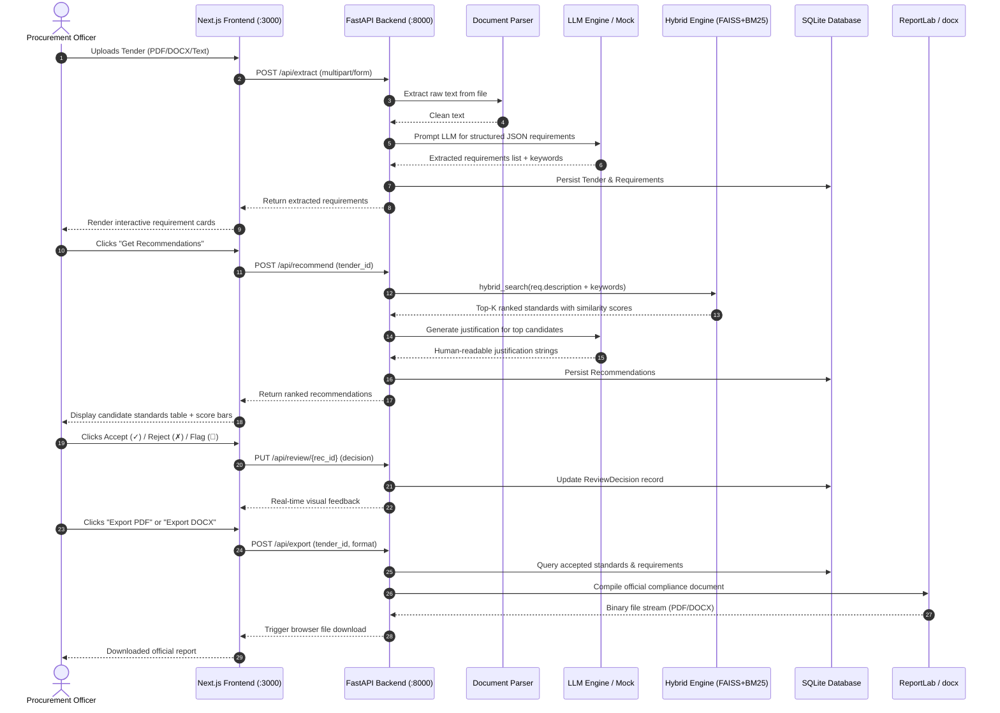
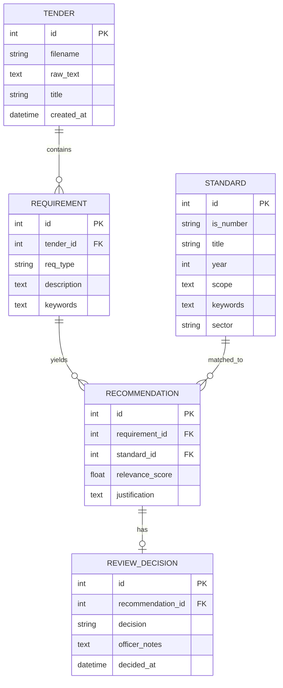

# 📖 Manak Mitra — Complete Website & System Working Explainer

This document provides a comprehensive, end-to-end technical and functional explanation of the **Manak Mitra** platform, its architecture, mathematical search algorithms, data models, user interface workflows, and deployment instructions.

---

## Table of Contents
1. [Executive Summary & Problem Statement](#1-executive-summary--problem-statement)
2. [End-to-End System Workflow (The 5 Steps)](#2-end-to-end-system-workflow-the-5-steps)
3. [System Architecture & Data Flow](#3-system-architecture--data-flow)
4. [Deep Dive into the AI & Search Algorithms](#4-deep-dive-into-the-ai--search-algorithms)
   - [4.1 Dense Vector Semantic Search (FAISS)](#41-dense-vector-semantic-search-faiss)
   - [4.2 Sparse Lexical Search (BM25Okapi)](#42-sparse-lexical-search-bm25okapi)
   - [4.3 Hybrid Score Combination](#43-hybrid-score-combination)
   - [4.4 LLM Requirement Extraction & Justifications](#44-llm-requirement-extraction--justifications)
   - [4.5 Zero-Key Mock Fallback Mechanism](#45-zero-key-mock-fallback-mechanism)
5. [Database Architecture & Entity Relationships](#5-database-architecture--entity-relationships)
6. [Website Walkthrough & User Guide](#6-website-walkthrough--user-guide)
   - [Page 1: Landing Dashboard (`/`)](#page-1-landing-dashboard-)
   - [Page 2: New Analysis (`/analysis/new`)](#page-2-new-analysis-analysisnew)
   - [Page 3: Analysis Results & Officer Review (`/analysis/[id]`)](#page-3-analysis-results--officer-review-analysisid)
   - [Page 4: Standards Library (`/standards`)](#page-4-standards-library-standards)
7. [Export Engine (PDF & DOCX)](#7-export-engine-pdf--docx)
8. [API Reference Guide](#8-api-reference-guide)
9. [Future Roadmap & Architectural Stubs](#9-future-roadmap--architectural-stubs)
10. [Setup, Verification & Running Guide](#10-setup-verification--running-guide)

---

## 1. Executive Summary & Problem Statement

### The Problem in Public Procurement
In government and public sector tenders in India (via platforms like GeM and CPPP), procurement specifications frequently require compliance with national standards issued by the **Bureau of Indian Standards (BIS)**. However:
- Tenders often span dozens or hundreds of pages of complex technical jargon.
- Non-specialist procurement officers must manually read documents and cross-reference thousands of Indian Standards (IS).
- Human oversights lead to missing safety standards, obsolete standard citations, contractor disputes, rejection of bids, or compromised project safety.

### The Solution: Manak Mitra
**Manak Mitra** ("Friend of Standards") is an AI-powered copilot for procurement officers:
- Automatically reads complex tender documents in PDF, DOCX, or text format.
- Breaks down tenders into discrete, classified requirements (technical, material, safety, performance).
- Discovers the exact applicable Indian Standards using a high-precision **Hybrid Search Engine (FAISS + BM25)**.
- Explains in clear human language *why* each standard is recommended.
- Offers an intuitive **Officer Review Interface** to accept, reject, or flag recommendations.
- Compiles approved standards into official compliance reports in PDF and DOCX formats.

---

## 2. End-to-End System Workflow (The 5 Steps)



---

## 3. System Architecture & Data Flow

The platform follows a decoupled, service-oriented architecture:

```
┌─────────────────────────────────────────────────────────────┐
│                    NEXT.JS FRONTEND (PORT 3000)             │
│                                                             │
│  [Dashboard]      [New Analysis]    [Review / Export]       │
│  page.tsx         analysis/new      analysis/[id]           │
│                                                             │
│  [Standards Library]  [Components]  [API Client]            │
│  standards/page.tsx   Cards,Tables  lib/api.ts              │
└──────────────────────────────┬──────────────────────────────┘
                               │ HTTP REST Requests (JSON / FormData)
                               ▼
┌─────────────────────────────────────────────────────────────┐
│                   FASTAPI BACKEND (PORT 8000)               │
│                                                             │
│  Routers:                                                   │
│  • extract.py     • recommend.py   • review.py              │
│  • standards.py   • export.py      • health / tenders       │
│                                                             │
│  Services:                                                  │
│  • search_service.py   (FAISS + BM25 Hybrid Retrieval)      │
│  • llm_service.py      (Extraction, Justifications, Mock)   │
│  • document_parser.py  (PyPDF2 & python-docx)               │
│  • export_service.py   (ReportLab & python-docx Generator)  │
│  • stubs.py            (Future integration endpoints)       │
└──────────────┬──────────────────────────────┬───────────────┘
               │                              │
               ▼                              ▼
┌──────────────────────────────┐ ┌────────────────────────────┐
│      SEARCH & NLP STACK      │ │        STORAGE LAYER       │
│                              │ │                            │
│ • sentence-transformers      │ │ • SQLite: manak_mitra.db   │
│   (all-MiniLM-L6-v2, 384-dim)│ │   (Tenders, Requirements,  │
│ • FAISS (Flat Inner Product) │ │    Standards, Recs,        │
│ • BM25Okapi (Tokenized Text) │ │    ReviewDecisions)        │
│ • OpenAI API / Mock Fallback │ │ • Seed: standards_data.json│
└──────────────────────────────┘ └────────────────────────────┘
```

---

## 4. Deep Dive into the AI & Search Algorithms

A core innovation in Manak Mitra is its **dual-path hybrid search system**. Real-world tender requirements often contain both semantic descriptions (*"resistant to extreme fire conditions"*) and precise keywords (*"OPC 53 grade", "Fe 500D", "FRLS"*). A pure semantic vector search or a pure keyword search would miss critical matches.

### 4.1 Dense Vector Semantic Search (FAISS)
1. **Model**: `sentence-transformers/all-MiniLM-L6-v2` produces dense vectors of dimension $d = 384$.
2. **Corpus Ingestion**: For every standard $S$, a representative text is built:
   $$\text{Corpus}(S) = \text{is\_number} + \text{title} + \text{scope} + \sum \text{keywords}$$
3. **L2 Normalization**: Vectors are unit-normalized:
   $$\hat{v} = \frac{v}{\|v\|_2}$$
4. **Index Type**: `faiss.IndexFlatIP` computes the inner product directly:
   $$\text{CosineSimilarity}(q, d) = \hat{q} \cdot \hat{d}$$
   Because vectors are normalized, inner product is identical to cosine similarity in range $[0, 1]$.

### 4.2 Sparse Lexical Search (BM25Okapi)
For exact technical tokens (such as *"IS 456"*, *"Fe 500D"*, *"cement"*), the BM25 algorithm computes lexical relevance:
$$\text{Score}_{BM25}(D, Q) = \sum_{i=1}^{n} \text{IDF}(q_i) \cdot \frac{f(q_i, D) \cdot (k_1 + 1)}{f(q_i, D) + k_1 \cdot \left(1 - b + b \cdot \frac{|D|}{\text{avgdl}}\right)}$$
- $k_1 = 1.5$ (term saturation parameter)
- $b = 0.75$ (document length penalization parameter)
- Stop words (*the, of, and, for, etc.*) are stripped, and scores are normalized to $[0, 1]$.

### 4.3 Hybrid Score Combination
For any query $Q$ (composed of requirement text + extracted keywords), the final score for standard $S_j$ is:
$$\text{Score}_{hybrid}(S_j) = w_{faiss} \cdot \text{Score}_{faiss}(S_j) + w_{bm25} \cdot \text{Score}_{bm25}(S_j)$$
- Configured default weights:
  - $w_{faiss} = 0.60$ (semantic weight)
  - $w_{bm25} = 0.40$ (lexical weight)
- Candidates with $\text{Score}_{hybrid} < 0.01$ are pruned. The top-$K$ candidates (default $K = 5$) are ranked in descending order.

### 4.4 LLM Requirement Extraction & Justifications
- **Requirement Extraction**: The prompt asks the LLM to inspect raw tender text, identify all technical deliverables, safety mandates, and material specifications, and return valid JSON with:
  - `req_type`: `"technical" | "safety" | "quality" | "material" | "performance"`
  - `description`: Self-contained technical clause
  - `keywords`: 3–5 domain tokens
- **Relevance Justification**: For each top match, the LLM receives the requirement description and the matched standard's title and scope, returning a concise, 1–2 sentence explanation of why this standard governs the requirement.

### 4.5 Zero-Key Mock Fallback Mechanism
When no `OPENAI_API_KEY` is provided:
- **Extraction**: Uses a specialized rule-based regex analyzer that detects civil, electrical, IT, fire, and food clauses by domain keywords.
- **Justifications**: Uses deterministic templated explanations incorporating the standard number and technical scope.
- **Result**: The complete application is 100% testable and runnable offline.

---

## 5. Database Architecture & Entity Relationships

The relational database is managed via SQLite and SQLAlchemy ORM:



---

## 6. Website Walkthrough & User Guide

### Page 1: Landing Dashboard (`/`)
- **Hero Section**: Introduces Manak Mitra with active status badges.
- **Backend Health Sentinel**: Checks `/api/health` asynchronously. Displays a warning banner if the server is offline.
- **Quick Action Cards**:
  - **New Analysis**: One-click navigation to upload or paste a tender.
  - **Standards Library**: One-click access to browse the standards repository.
  - **Live BIS Integration**: Explains the upcoming integration with the BIS catalog.
- **Recent Analyses Table**: Lists all previously parsed tenders, requirement counts, timestamps, and direct links to view or resume reviews.

### Page 2: New Analysis (`/analysis/new`)
- **Mode Toggle**:
  - **Upload File**: Drag-and-drop or file browser supporting `.pdf`, `.docx`, and `.txt`.
  - **Paste Text**: Direct text area input with character counter (minimum 50 characters).
- **Load Sample Tender**: For demo purposes, clicking "Load Sample Tender" randomly picks from pre-loaded tender documents (Civil Construction, IT Hardware Procurement, or Food Safety & Rations).
- **Submit Button**: Executes AI extraction with loading indicator. Upon completion, redirects to `/analysis/{tender_id}`.

### Page 3: Analysis Results & Officer Review (`/analysis/[id]`)
- **Metrics Summary Bar**:
  - Total Requirements extracted
  - Total Recommendations generated
  - Total Accepted standards
  - Total Reviewed ratio
- **"Get Recommendations" Action**: Queries the hybrid search engine for all requirements simultaneously.
- **Requirement Cards**:
  - Requirement index and categorized badge (e.g. `TECHNICAL`, `SAFETY`, `MATERIAL`, `PERFORMANCE`).
  - Extracted requirement text and keyword tags.
- **Candidate Standards Table**:
  - **IS Number** (e.g. `IS 456:2000`, `IS 269:2015`).
  - **Title** of the standard.
  - **Relevance Score**: Visual progress bar colored green (>70%), yellow (40–70%), or gray (<40%).
  - **Justification**: Explanation of why the standard applies.
  - **Decision Controls**:
    - **✓ (Accept)**: Marks the standard as approved for tender compliance.
    - **✗ (Reject)**: Rejects irrelevant or redundant candidates.
    - **🚩 (Flag)**: Flags for secondary supervisory review.
- **Export Action**:
  - **📥 Export PDF**: Downloads an official compliance report.
  - **📥 Export DOCX**: Downloads an editable Microsoft Word document.

### Page 4: Standards Library (`/standards`)
- **Instant Search**: Real-time filtering by standard number, title, scope, or keyword.
- **Sector Filter Dropdown**: Filter by sector (Civil Engineering, Electrical, IT, Fire Safety, Food & Agriculture, Textiles, Mechanical, Chemicals).
- **Expandable Accordion Cards**: Click any standard to reveal its full BIS scope description, year of release, keywords, and internal ID.

---

## 7. Export Engine (PDF & DOCX)

The export engine generates formal audit-ready compliance documents:

### PDF Generator (`ReportLab`)
- **Format**: Standard A4 page size with structured margins and headers.
- **Palette**: Official government styling with deep navy (`#1a365d`) headers and charcoal tables.
- **Content**:
  1. Title header with timestamp.
  2. Tender metadata & summary statistics.
  3. Formatted tables per requirement detailing IS Number, Title, and Justification.
  4. Legal advisory footer.

### DOCX Generator (`python-docx`)
- Generates an editable `.docx` document formatted with styled tables, headings, and margins for direct insertion into formal tender dossiers.

---

## 8. API Reference Guide

| Method | Route | Description | Request Body / Params |
|--------|-------|-------------|-----------------------|
| `GET` | `/api/health` | Service health status | None |
| `GET` | `/api/tenders` | List all historical tenders | None |
| `GET` | `/api/sample-tenders` | Get built-in tender samples | None |
| `POST` | `/api/extract` | Parse document & extract requirements | `file: UploadFile` OR `text: Form[str]` |
| `POST` | `/api/recommend` | Run hybrid search for tender | `{"tender_id": int}` |
| `GET` | `/api/tenders/{id}/review` | Retrieve tender with review statuses | Path parameter `id` |
| `PUT` | `/api/review/{id}` | Accept, reject, or flag a recommendation | `{"decision": "accept"|"reject"|"flag", "officer_notes": str}` |
| `GET` | `/api/standards` | List/search Indian Standards | Query params: `search`, `sector` |
| `GET` | `/api/standards/sectors`| Get list of unique sectors | None |
| `GET` | `/api/standards/{id}` | Get single standard details | Path parameter `id` |
| `POST` | `/api/export` | Download PDF or DOCX report | `{"tender_id": int, "format": "pdf"|"docx"}` |

---

## 9. Future Roadmap & Architectural Stubs

Located in [`backend/services/stubs.py`](file:///d:/SIH%202026/backend/services/stubs.py):

1. **Neo4j Knowledge Graph (`get_related_standards`, `get_standard_lineage`)**:
   - Enables graph traversals for standard relationships: *supersedes*, *amends*, *referenced_by*.
2. **Sarvam AI Translation (`translate_text`, `detect_language`)**:
   - Native multilingual translation for non-English state tenders (Hindi, Tamil, Telugu, Marathi).
3. **Live BIS API Connector (`search_bis_catalog`, `check_standard_status`)**:
   - Real-time catalog queries for active, revised, or withdrawn standards.
4. **GeM / CPPP Procurement Integration (`search_gem_products`, `fetch_cppp_tenders`)**:
   - Automatic fetching of tenders and vendor-compliant catalog items from Government e-Marketplace.

---

## 10. Setup, Verification & Running Guide

### Quick Start (Terminal Commands)

#### 1. Start Backend (Port 8000)
```powershell
cd "d:\SIH 2026\backend"
python main.py
```

#### 2. Start Frontend (Port 3000)
```powershell
cd "d:\SIH 2026\frontend"
npm run dev
```

#### 3. Run Automated Tests
```powershell
cd "d:\SIH 2026"
# Run pytest unit and integration tests
python -m pytest backend/tests/ -v

# Run live end-to-end pipeline verifier
python backend/tests/verify_live.py
```

---

*Authored for Smart India Hackathon (SIH 2026)*
